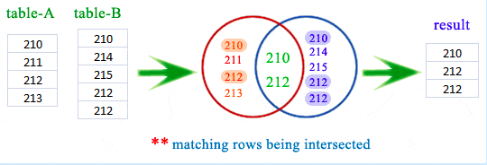
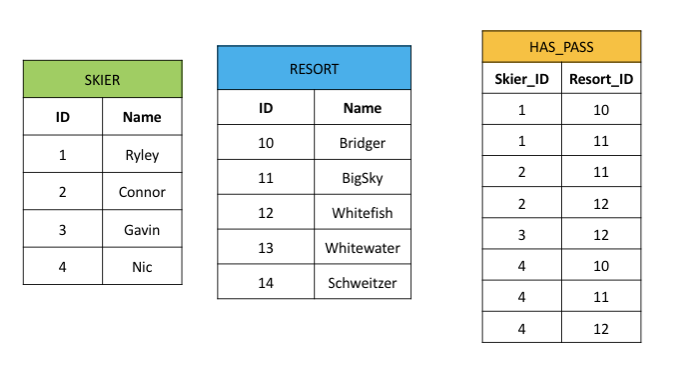
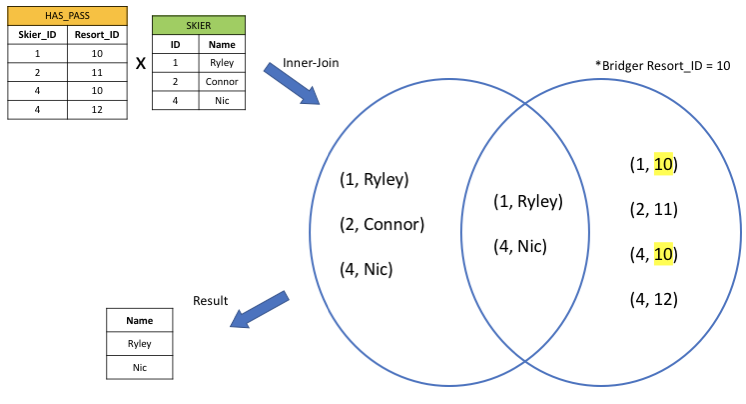

# Inner-Join or Where? The Choice is Yours

## INTRODUCTION
Welcome to the tutorial. In this lesson, we will provide a brief overview of the inner-join and where clauses in SQLite. We will demonstrate some simple problems where an inner-join can be rewritten with a where clause. Finally, we will provide you with additional exercises to practice selecting data from two or more tables using both methods.  

***It is our goal that by the end of this tutorial, you will be able to make a more informed decision on your preferred method of joining tables.***

## PREREQUISITES
We prepared this tutorial for Computer Science students who are either currently enrolled in or have previously taken a Database Systems course. We assume the reader has basic knowledge of the following:

- The operating system on their personal machine and how to install software on their machine
- Working on the command line i.e. creating files, changing directories, etc.
- Constructing ER Models and Relational Schemas (keys, relations, constraints, etc.)
- Relational Algebra
- Basic SQLite [syntax](http://www.sqlitetutorial.net)

***For this tutorial, we will be using MacOS.***

## PART 0
Before we can start playing around with SQLite statements, we need to install the software onto our machine. SQLite3 is pre-installed on MacOS, but it does not take more than a few minutes to install if you are using another operating system.  

**Step #1** 

- Please visit the [download page](https://www.sqlite.org/download.html).

***We have also provided more detailed instructions [here](setup.md).***

## PART I
Now that we have SQLite installed on our machine and are able to open up a terminal to make commands, we can discuss some details of the inner-join clause.
Inner-join clauses allow you to query data from multiple tables by combining the columns.
The following diagram illustrates how inner-join clauses sort the necessary data.

**In this case, it does an *intersection* on two sets of numbers.**

The syntax for an inner-join looks like:

    SELECT attribute_list  
    FROM table_one  
    INNER JOIN table_two  
    ON attribute_condition
    
- attribute_list represents the attributes that you want to view 
- table_one represents the table that you want to select the attributes from
- table_two represents the table that you want to join with table_one
- attribute_condition represents the condition on which you filter the data

For our simple database, which we will provide later, the data would be organized something like the illustration below.  

If we were interested in selecting the Skiers' names who had a pass to Bridger, our inner-join would combine the data in the Skier and HasPass tables something like this.  

Let's look at an example to see how it works!

**Step #1**  
In order to play around with the inner-join clause, we first need to create some tables and insert values into those tables. We have provided a basic .sql file to represent our test database.

- View/download the data [here](data.sql).

***The file needs to be in your current working directory for SQLite to work with it.***

**Step #2**  
Open up the SQLite REPL and read in the data by running the following commands:

    $ sqlite3 tmp.db 
    SQLite version 3.19.3 2017-06-27 16:48:08
    Enter ".help" for usage hints.
    Connected to a transient in-memory database.
    Use ".open FILENAME" to reopen on a persistent database.
    sqlite> .read data.sql
    
If reading in data was successful, there should be no output. We can ensure the data was read in by running the following command:

    sqlite> .tables
    
Which should give us the following output:

    sqlite> .tables
    HasPass  Resort   Skier
    
Great! Now that we have some data to play around with, let's look at a simple inner-join problem.

**Example #1:** Given our database of Skiers and Resorts, select the name and ID of all Skiers that have a pass to Bridger.

One possible solution looks like:

    sqlite> select ID, name from Skier 
       ...> inner join HasPass on Resort_ID in (select ID from Resort where name = 'Bridger') 
       ...> and ID = Skier_ID;
       
**Problem #1:** Modify the above solution to select the name and ID of all Skiers that have a pass to Big Sky.

The output should look something like:

    ID          name      
    ----------  ----------
    1           Ryley     
    2           Connor    
    4           Nic

You can view the solution [here](soln1.sql).

## PART II
Now that we have seen the syntax of inner-join for a simple problem, let's discuss some details of the where clause. Where clauses specify a condition that is used to retrieve data from one or more tables. 
The syntax for a where clause looks like:

    SELECT <attribute_list>  
    FROM <table_list>  
    WHERE <attribute_condition>

- attribute_list represents the attributes that you want to view
- table_list represents the tables that you wish to select attributes from
- attribute_condition represents the condition on which you filter the data

**Example #2:** Select the name and ID of all Skiers that have a pass to Bridger. This time, however, we will use the where clause.

One possible solution looks like:

    sqlite> select ID, name from Skier, HasPass 
       ...> where Resort_ID in (select ID from Resort where name = 'Bridger')
       ...> and ID = Skier_ID;
       
**Problem #2:** Modify the above solution to select the name and ID of all Skiers who have a pass to Big Sky. The output should look like the previous output from Part II.

You can view the solution [here](soln2.sql).

## PART III
As you can see, the syntax between inner-join/where is very similar for a simple problem like this. The main difference is that the where condition hides the intent of the join condition (by expressing the join in the where clause). In our opinion, especially for more difficult queries, the where clause is a more clear representation of what attributes are being compared from the given tables. Both the where clause and inner-join clause return the same result and have the same performance.

Let's try another fairly basic problem where we can highlight the differences between using a where clause vs. an inner-join clause.

**Problem #3:** Select the name of all Resorts that no Skiers have a pass to using both:

- An inner-join statement
- A where statement

Try not to look at the [solution](soln3.sql) until you have attempted it yourself.  

As you can see, the syntax changed slightly between the two queries, but they both produce the same result. The inner-join query required that we use the distinct keyword, while the where query did not. In this specific example, the where query is easier to decipher exactly what the conditions are and from what tables attributes are being selected.

## PART IV
In this part we will present two additional (likely more difficult) problems for you to improve your SQLite skills. These problems are meant to highlight the difference between using a where clause and using an inner-join clause. 

**Problem #4:** Select the name of the Skier who has the most passes. Also display the number of passes he/she has.

You can view the solution [here](soln4.sql). Try to not look at it until you have attempted the problem yourself.

**Problem #5:** Select the name of all Skiers who have a pass to more than one resort.

You can view the solution [here](soln5.sql).

## Closing Remarks
We hope this tutorial was worthwhile and that you feel more comfortable using both where and inner-join statements in SQLite. Both methods of combining tables produce the same result, but the syntax can vary across different solutions. If you made it this far, hopefully you now have a stronger opinion on which join statement you prefer! Thanks for your time.

## Acknowledgements
[References](references.txt)
